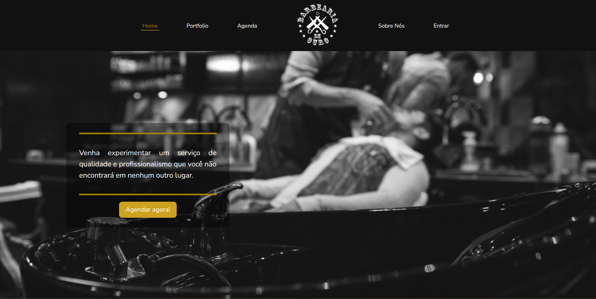

<h1 align="center">
  
</h1>

  <a href="#-tecnologias">Tecnologias</a>&nbsp;&nbsp;&nbsp;|&nbsp;&nbsp;&nbsp;
  <a href="#-projeto">Projeto</a>&nbsp;&nbsp;&nbsp;|&nbsp;&nbsp;&nbsp;
  <a href="#-como-executar">Como executar</a>&nbsp;&nbsp;&nbsp;|&nbsp;&nbsp;&nbsp;
  <a href="#-licença">Licença</a>

  

 

  

## ✨ Tecnologias

Esse projeto foi desenvolvido com as seguintes tecnologias:

- [Laravel](https://laravel.com/)
- [Tailwind](https://tailwindcss.com/)
- [Livewire](https://laravel-livewire.com/)

## 💻 Projeto

Esse projeto é um sistema de agendamento de horários para uma barbearia local, aonde os clientes podem realizar seu cadastro e assim agendar seu horário ou até fazer assinaturas mensais e escolher o cabeleleiro que deseja com o horário e dia livre.

## 🚀 Como executar

- Clone o repositório
- Certifique de ter o docker instalado na sua maquina
- Rode o comando `docker run --rm \
    -u "$(id -u):$(id -g)" \
    -v "$(pwd):/var/www/html" \
    -w /var/www/html \
    laravelsail/php82-composer:latest \
    composer install --ignore-platform-reqs`
- Rode o sail com o comando `./vendor/bin/sail up -d`
- Instale as dependências com `./vendor/bin/sail npm i`
- Rode as migrations e as popule para os testes `./vendor/bin/sail art migrate --seed`
- Inicie o servidor com `/vendor/bin/sail npm run dev`

Agora você pode acessar [`localhost`](http://localhost) do seu navegador.

## 📄 Licença

Esse projeto está sob a licença MIT. Veja o arquivo [LICENSE](LICENSE.md) para mais detalhes.

---

Feito com ♥ by VictorSFDev 👋🏻

<!--START_SECTION:footer-->

 
 

  

<!--END_SECTION:footer-->
